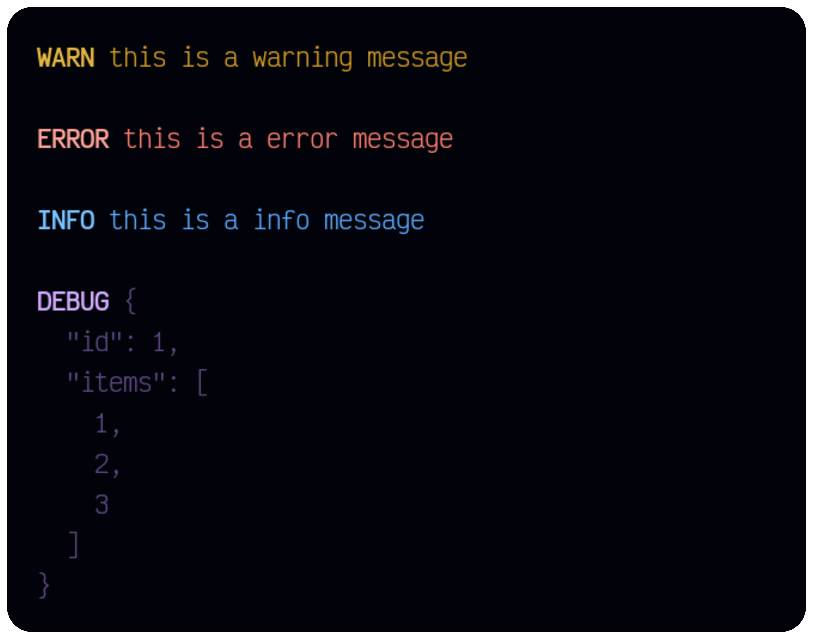

# CmDye


**CmDye** is a tiny tool to colorify console messages. Whether for your everyday [**console.log()**](https://developer.mozilla.org/en-US/docs/Web/API/Console/log) or for seamless integration with more sophisticated logger tools.

## Getting started

After installing the `cmdye` package you can create a message like this:


This message was build using the string substitution patterns:

```js
const cmdye = require('cmdye');

cmdye('%cConsole %cmessages %cdye').apply('magenta,italic', 'yellow', 'cyan');
```

`cmdye` function allows you to define the message, and `.apply()` to select which colors should be applied to the message.

### Examples

#### Console logs



Create messages without having to import multiple functions or handle dozens of chained functions:

```js
const warn = (msg) => cmdye('%cWARN%c', msg).apply('yellow,bold', '!bold');

const error = (msg) => cmdye('%cERROR%c', msg).apply('red,bold', '!bold');

const info = (msg) => cmdye('%cINFO%c', msg).apply('blue,bold', '!bold');

const debug = (msg) => cmdye('%cDEBUG%c', msg).apply('magenta,bold', '!bold,dim');
```

## API

### cmdye(...msg: unknown[])

The `cmdye()` function can take **any** arguments, from numbers and strings to objects.


#### .apply(...codes: AnyCodes[])

The `.apply()` method ships with types for all available codes.


## Performance

On benchmarks **CmDye** wasn't as performant as other options, since it essentially requires loop cycles, which are less performant than straight calls to functions.

Even though, each [console logs examples above](#console-logs) takes roughly `~1 ms` to be printed using [**console.log()**](https://developer.mozilla.org/en-US/docs/Web/API/Console/log) tested on multiple benchmarks.

## Contributions

All contributions, from suggesting ideas and reporting bugs to fixing typos are needed. Be welcome to:

- Open [Issue](https://github.com/santosned/cmdye/issues)
- Open [PR](https://github.com/santosned/cmdye/pulls)
